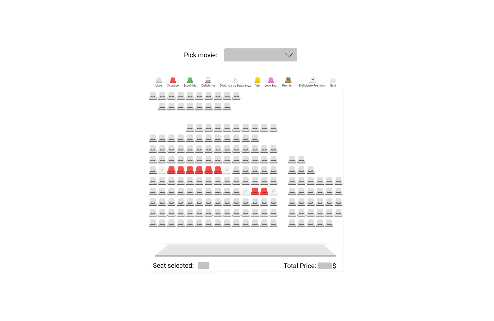

<h1 align="center">Welcome to movie-booking 👋</h1>
<p>
  
  <a href="#" target="_blank">
    
  </a>
</p>

<p >
  
</p>

## Install

```sh
yarn install
```

## Author

👤 **leo Franca <leoarkiteto@gmail.com>**


## Show your support

Give a ⭐️ if this project helped you!

***
_This README was generated with ❤️ by [readme-md-generator](https://github.com/kefranabg/readme-md-generator)_
